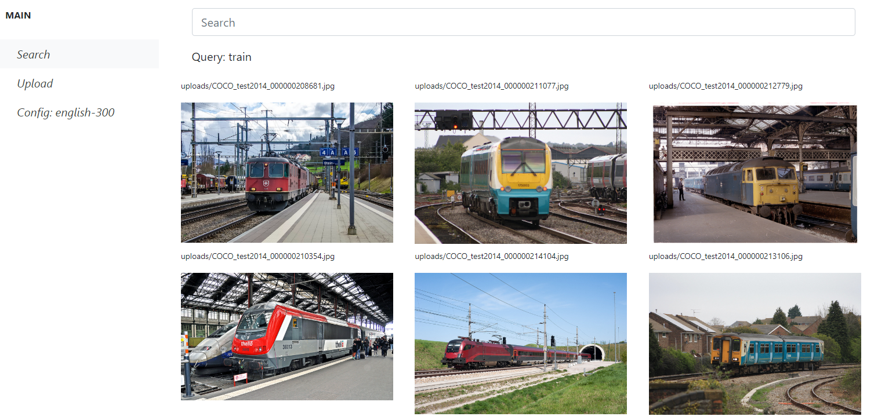

# Semantic Image Retrieval

<p>
Alguna vez se han preguntado si pueden buscar imagenes en su computador tal como lo hacen en Google? <br>
Aplicando tecnicas de Computer Vision, Natural Lenguage Processing y un poco de creatividad se puede! <br>
</p>


### Instalar dependencias

Para utilizar este repositorio primero debes clonarlo e instalar las dependencias:

```
git clone https://github.com/bldr1862/semantic-image-retrieval.git
cd semantic-image-retrieval
python -m venv virtual_env
cd virtual_env/Scripts/
activate
cd ../../
pip install -r requirements.txt
```

### Configuración

Descargar los modelos de los siguientes links, descomprimelos y copia las carpetas dentro de "models/"
* english-128: https://drive.google.com/file/d/1Cr7ZIYqYdoYUVHjHoEj_YoPY6Zh8swRG/view?usp=sharing -> Modelo en ingles de 128 dimensiones
* english-300: https://drive.google.com/file/d/1TQxYBlQe7Cr1jU9zsbslGCcSGaxEIAT_/view?usp=sharing -> Modelo en ingles de 300 dimensiones


Abrir el archivo config y setear la variable "MODEL_CONFIG" al valor deseado. Se recomienda usar el valor por defecto.

### Start App

Para ejecutar la aplicación, debes ejecutar el siguiente comando, el cual levantara un servicio en el puerto 8080 (si estas usando este puerto en otro servicio,
puedes cambiarlo en el app.run de main.py)

```
python main.py
```

### Cómo usar?

Ingresa la siguiente dirección en tu navegador: http://127.0.0.1:8080/ Luego ingresa a la seccion uploads y sube las fotos en las que quieres buscar.
Cuando subes las fotos el sistema debe indexarlas para poder buscar en ellas, por lo tanto, este paso puede demorar bastante según la cantidad de fotos que subas.
Cuando esto termina, te va a redirigir a la seccion Search donde puedes buscar en tus imagenes
Entrar a uploads y subir las fotos, luego entrar a search y empezar a buscar. En la barra lateral aparece el modelo que se está usando